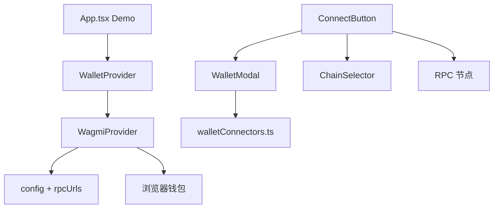
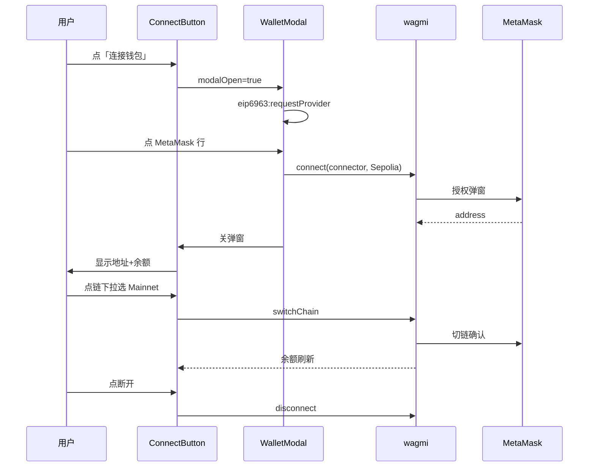

# Wallet SDK 设计解读（傻瓜式手册）

> 面向 Web3 新手：先懂为什么 → 再懂点击会发生什么 → 再对照源码。  
> 代码目录：`src/`；每个源文件顶部均有 **【原理 / 点击流程 / 注意】** 块注释。

---

## 目录

0. [现在够不够灵活](#0-现在够不够灵活)  
0.5. [注释怎么读](#05-注释怎么读)  
1. [这个 SDK 解决什么问题](#1-这个-sdk-解决什么问题)  
2. [技术选型](#2-技术选型为什么用-wagmi--viem)  
3. [整体架构](#3-整体架构一张图)  
4. [从零搭建 10 步](#4-从零搭建推荐按这-10-步做)  
5. [分文件设计思路](#5-每一步的设计思路对应源码文件)  
6. [三条核心数据流](#6-三条核心数据流必背)  
7. [ConnectButton 三种样式](#7-connectbutton-三种样式怎么设计)  
8. [Bug 与根因](#8-你曾经遇到的-bug-与根因)  
9. [注意事项清单](#9-注意事项清单开发时对照)  
10. [安全与风险](#10-安全与风险规避)  
11. [以后扩展](#11-以后扩展npm-发包加链walletconnect)  
12. [建议学习顺序](#12-建议学习顺序)  
13. [全项目源码导读表](#13-全项目源码导读表)  
14. [端到端点击总览](#14-端到端点击总览)  
15. [自动重连双层机制](#15-自动重连双层机制)  
16. [EIP-6963 与全部已安装钱包](#16-eip-6963-与全部已安装钱包)  
附录. [目录速查](#附录目录与职责速查)

---

## 0. 现在够不够「灵活」？

| 能力 | 是否灵活 | 怎么扩展 |
|------|----------|----------|
| 显示**全部**已安装钱包 | 是 | EIP-6963 + `getInstalledBrowserConnectors()`，**无个数上限** |
| 推荐安装列表 | 是 | 只改 `constants/wallets.ts` |
| 钱包图标 | 是 | `walletIcons.ts` + `WalletIcon.tsx` 降级 |
| 支持哪些链 | 是 | `wagmi/config.ts` + `rpcUrls.ts` |
| 连接按钮样式 | 是 | `ConnectButton` props |
| 余额 / 签名 / 转账 | 是 | 三个 Hook 可单独用 |

---

## 0.5 注释怎么读？

每个重要 `.ts` / `.tsx` 文件开头通常有：

```
// =============================================================================
// 文件名 — 一句话职责
// =============================================================================
// 【原理】...
// 【点击流程】...（有交互的文件才有）
// 【注意】...
```

| 标记 | 含义 |
|------|------|
| `【点击流程】` | 用户点按钮后，函数调用顺序 |
| `【原理】` | 背后 Web3 / wagmi 机制 |
| `【注意】` | 踩坑点 |

**建议阅读顺序**见 [§12](#12-建议学习顺序)；**每个文件读什么**见 [§13](#13-全项目源码导读表)。

---

## 1. 这个 SDK 解决什么问题

### 1.1 没有 SDK 时

| 事情 | 难点 |
|------|------|
| 检测已安装钱包 | API 不统一 |
| 授权与刷新保持连接 | 要自己存状态 |
| 查余额 | chainId、RPC、wei |
| 切链 | 钱包弹窗确认 |
| 签名 / 转账 | 私钥不能进网页 |

### 1.2 本 SDK 对外形态

```
<WalletProvider>
  <ConnectButton />           ← 连接 + 链 + 地址 + 余额 + 断开
  useWalletBalance()          ← 自定义 UI
  useWalletSignMessage()
  useWalletSendTransaction()
</WalletProvider>
```

**设计原则：** 配置集中（`config.ts`）、UI 可换（Hook）、状态单一来源（wagmi Context）。

---

## 2. 技术选型：为什么用 wagmi + viem

| 库 | 角色 |
|----|------|
| wagmi | React Hooks：连接、余额、切链 |
| viem | 链定义、wei 格式化、类型 |
| @wagmi/connectors | MetaMask / injected 等 |
| @tanstack/react-query | RPC 缓存（wagmi 内置） |
| Tailwind v4 | ConnectButton 样式 |

---

## 3. 整体架构一张图



---

## 4. 从零搭建：推荐按这 10 步做

| 步 | 文件 | 完成标志 |
|----|------|----------|
| ① | `package.json` | 依赖装好 |
| ② | `wagmi/config.ts` + `rpcUrls.ts` | 多链 + RPC |
| ③ | `WalletProvider.tsx` | Provider 包住应用 |
| ④ | `WalletModal.tsx` + `walletConnectors.ts` | 能选钱包连接 |
| ⑤ | `ConnectButton.tsx` | 三态 UI |
| ⑥ | `useWalletBalance.ts` | 有余额 |
| ⑦ | `ChainSelector.tsx` | 能切链 |
| ⑧ | `connect` 带 `DEFAULT_CHAIN_ID` | 默认 Sepolia |
| ⑨ | `useAutoReconnect.ts` | 刷新可恢复 |
| ⑩ | `demo/*` + `index.ts` | build 通过 |

---

## 5. 每一步的设计思路（对应源码文件）

### `wagmi/config.ts` + `rpcUrls.ts`

- **chains**：合法网络列表  
- **connectors**：`injected()` 发现全部 EIP-6963 插件 + `metaMask()` + `coinbaseWallet()`  
- **transports**：每条链显式 RPC URL；**禁止裸 `http()`**（会 CORS 失败）

### `WalletProvider.tsx` + `useAutoReconnect.ts`

见 [§15 自动重连](#15-自动重连双层机制)。

### `walletConnectors.ts` + `WalletModal.tsx`

见 [§16 EIP-6963](#16-eip-6963-与全部已安装钱包)。

### `ConnectButton.tsx` + `ChainSelector.tsx`

见 [§14 点击总览](#14-端到端点击总览)。

### `useWalletBalance.ts` + `formatBalanceText.ts`

- `query.enabled`：未连接不发 RPC  
- `formatUnits`：wagmi v3 无 `.formatted`  
- `isFetching`：切链时显示「加载中」而非「获取失败」  
- `balance === "0"` 仍显示 `0 ETH`

### `useWalletSignMessage` / `useWalletSendTransaction`

- 用 `*Async` 方法，`await` 拿结果  
- 金额用 wei 字符串 + `BigInt`

### `WalletIcon.tsx`

图标降级：图片 → emoji → 首字母。

### `App.tsx` + `demo/*`

**禁止**在 `App()` 内定义子组件再用 Hooks。

---

## 6. 三条核心数据流（必背）

### 6.1 连接

`ConnectButton` → `WalletModal` → `connect({ connector, chainId })` → 钱包 `eth_requestAccounts` → `isConnected=true`

### 6.2 余额

`address` + `chainId` → `useBalance` → `eth_getBalance` → `formatUnits` → UI

### 6.3 切链

`switchChain` → 钱包确认 → `chainId` 变 → 余额 query 自动刷新

---

## 7. ConnectButton 三种样式怎么设计

| 模式 | 代码要点 |
|------|----------|
| 默认 | `<ConnectButton />` |
| 大尺寸 | `size="lg"` `accountStatus="full"` |
| 紧凑 | `size="sm"` `chainStatus="icon"` `showBalance={false}` |

同一组件，props 驱动 Tailwind class。

---

## 8. 你曾经遇到的 Bug 与根因

| 现象 | 根因 | 修复 |
|------|------|------|
| 余额失败 | 无 Sepolia transport / CORS | `rpcUrls.ts` |
| 主网 CORS | `eth.merkle.io` | 显式 RPC |
| 0 显示失败 | 用 `balance ?` 判断 | `formatBalanceText` |
| 余额闪 | App 内嵌组件 | `demo/*.tsx` |
| 只显示 3 个钱包 | 只看了推荐表 | EIP-6963 已安装区 |
| 重连误报失败 | 双重 `reconnect` | §15 |

---

## 9. 注意事项清单（开发时对照）

- [ ] 每条 chain 都有 transport  
- [ ] 浏览器不用裸 `http()`  
- [ ] Hooks 必须在 `WalletProvider` 下  
- [ ] 禁止 App 内嵌套 Hook 组件  
- [ ] 金额用 wei 字符串  
- [ ] `formatUnits` 不用 `.formatted`  
- [ ] Tailwind 要配置  

---

## 10. 安全与风险规避

- 私钥不进网页；签名/转账在钱包内确认  
- 主网用真钱，Demo 优先 Sepolia  
- 公共 RPC 不要泄露带 Key 的 URL  

---

## 11. 以后扩展：npm、加链、WalletConnect

- npm：`tsup` + `exports` + peerDependencies  
- 加链：`viem/chains` 导入 + `transports`  
- WalletConnect：申请 projectId，取消 config 注释  

---

## 12. 建议学习顺序

1. `wagmi/config.ts` → `rpcUrls.ts`  
2. `WalletProvider.tsx` → `useAutoReconnect.ts`  
3. `walletConnectors.ts` → `WalletModal.tsx`  
4. `ConnectButton.tsx` → `ChainSelector.tsx`  
5. `useWalletBalance.ts` → `formatBalanceText.ts`  
6. `WalletIcon.tsx` + `constants/*`  
7. `App.tsx` + `demo/*`  
8. `hooks` 签名/转账  
9. `index.ts`  

`npm run dev` 边点边看。

---

## 13. 全项目源码导读表

| 文件 | 职责 | 有无点击流程注释 |
|------|------|------------------|
| `main.tsx` | React 入口 | — |
| `App.tsx` | Demo 三种 ConnectButton | 结构说明 |
| `index.ts` | npm 导出 | — |
| **components** | | |
| `WalletProvider.tsx` | Provider 入口 | — |
| `ConnectButton.tsx` | 主按钮三态 | **有** |
| `WalletModal.tsx` | 选钱包弹窗 | **有** |
| `ChainSelector.tsx` | 切链下拉 | **有** |
| `WalletIcon.tsx` | 图标降级 | — |
| **hooks** | | |
| `useAutoReconnect.ts` | 延迟补连 | 原理 |
| `useWalletBalance.ts` | 余额 | 原理 |
| `useWalletSignMessage.ts` | 签名 | **有** |
| `useWalletSendTransaction.ts` | 转账 | **有** |
| **wagmi** | | |
| `config.ts` | wagmi 配置 | 原理 |
| `rpcUrls.ts` | 浏览器 RPC | 原理 |
| **utils** | | |
| `walletConnectors.ts` | 钱包列表逻辑 | 原理 |
| `formatBalanceText.ts` | 余额文案 | 判断顺序 |
| **constants** | | |
| `wallets.ts` | 推荐安装表 | 扩展说明 |
| `walletIcons.ts` | 图标兜底 | — |
| **types** | | |
| `connectButton.ts` | 按钮 props 类型 | 字段说明 |
| **demo** | | |
| `BalanceDisplay.tsx` | Hook 演示余额 | 有 |
| `SignDemo.tsx` | 签名演示 | **有** |
| `SendDemo.tsx` | 转账演示 | **有** |

---

## 14. 端到端点击总览



**未连接路径：** 仅 `ConnectButton` + `WalletModal`，不经过 ChainSelector。

**推荐安装路径：** `handleRecommendedClick` → 无 connector → `setInstallWallet` → `window.open`（不调用 wagmi）。

---

## 15. 自动重连双层机制

| 层 | 谁触发 | 何时 | 作用 |
|----|--------|------|------|
| 内置 | `WagmiProvider` `reconnectOnMount=true` | 页面加载立刻 | 读 `recentConnectorId` 静默连 |
| 补连 | `useAutoReconnect` | **600ms 后** | EIP-6963 连接器晚到时再试 |

**为何不要两处立刻 reconnect？**  
wagmi 内部 `isReconnecting` 锁会让第二次直接返回 `[]`，控制台误报「失败」。

**补连条件：** `!isConnected && recentConnectorId 存在`，且 `useRef` 只补一次。

---

## 16. EIP-6963 与全部已安装钱包

1. 每个浏览器插件可向页面 **announceProvider**（带 rdns、name、icon）。  
2. `injected()` + `multiInjectedProviderDiscovery` 变成多个 connector。  
3. 打开弹窗时 `dispatchEvent('eip6963:requestProvider')` 再扫一遍。  
4. `getInstalledBrowserConnectors()` 过滤、去重、排序 → UI 列表。  

**与 RECOMMENDED_WALLETS 关系：**

- **已安装区**：动态，装几个显示几个。  
- **推荐区**：仅显示配置表里、且**尚未**出现在已安装区的项。  

扩展图标：改 `walletIcons.ts` 或钱包项 `iconUrl`。

---

## 附录：目录与职责速查

| 路径 | 职责 |
|------|------|
| `src/wagmi/config.ts` | wagmi 总配置 |
| `src/wagmi/rpcUrls.ts` | 浏览器可用 RPC |
| `src/components/WalletProvider.tsx` | 入口 Provider |
| `src/components/ConnectButton.tsx` | 主按钮 |
| `src/components/WalletModal.tsx` | 选钱包 |
| `src/components/ChainSelector.tsx` | 切链 |
| `src/components/WalletIcon.tsx` | 图标 UI |
| `src/utils/walletConnectors.ts` | 钱包发现/去重 |
| `src/utils/formatBalanceText.ts` | 余额文案 |
| `src/constants/wallets.ts` | 推荐表 |
| `src/constants/walletIcons.ts` | 图标表 |
| `src/hooks/*.ts` | 余额/签名/转账/重连 |
| `src/demo/*.tsx` | 本地演示 |
| `src/index.ts` | 对外导出 |
| `docs/WALLET_SDK_DESIGN.md` | 本文档 |

---

*文档与当前代码同步（EIP-6963 全量已安装、双层重连、CORS RPC、全文件头注释）。*
